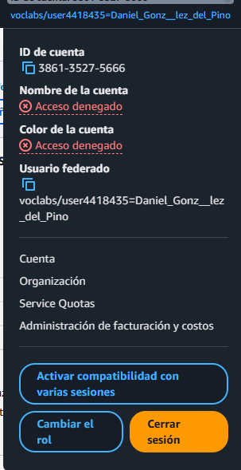
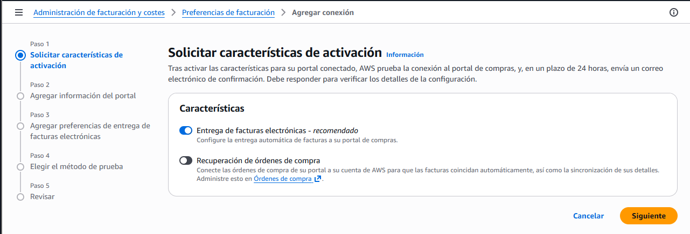

# Esto es un tutorial de como crear una alarma de facturacion en aws 

Con esto crearemos una alarma para saber cuanto gastamos en nuestra cuenta de aws y asi no tener "sustos"

## 1. Crear firma con la cuenta raiz
Firmate con tu correo que usaste para crear la cuenta

Aqui accederemos a nuestra cuenta de aws y deberemos ir al apartado de "Administracion de facturacion y costos"

En el menú de la izquierda nos iremos al apartado de "Preferencias de facturacion/Billing preferences"
En esta pantalla deberemos entrar en agregar conexion
Una vez dentro, activaremos la característica de "Entrega de facturas electrónicas"

