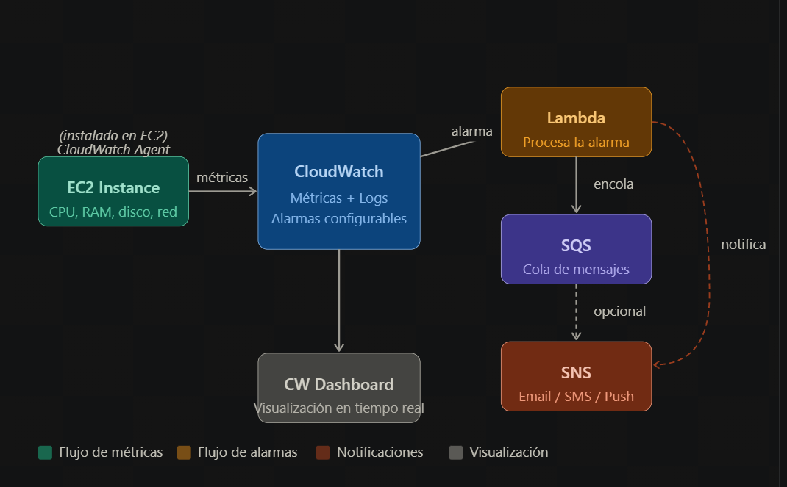

# Arquitectura de Monitoireo EC2

## Preparar EC2  e instalar Cloudwatch Agent
1. Creamos la instancia EC2
2. Asignar IAM Role con la política CloudWatchAgentServerPolicy (en mi caso LabRole)
3. Dentro de nuestra EC2 instalar:
    sudo yum install amazon-cloudwatch-agent -y
    sudo /opt/aws/amazon-cloudwatch-agent/bin/amazon-cloudwatch-agent-config-wizard
    El agente te preguntará que metricas recoger, Activar CPU, memoria, disco y logs de /var/log/messages
4. Arrancar el servicio
    sudo systemctl start amazon-cloudwatch-agent
    sudo systemctl enable amazon-cloudwatch-agent

## Crear alarmas en Cloudwatch
1. Entramos a Cloudwatch y vamos a crear una alarma
2. Metrica -> CWAgent > per-instance-metrics > cpu_usage_active

