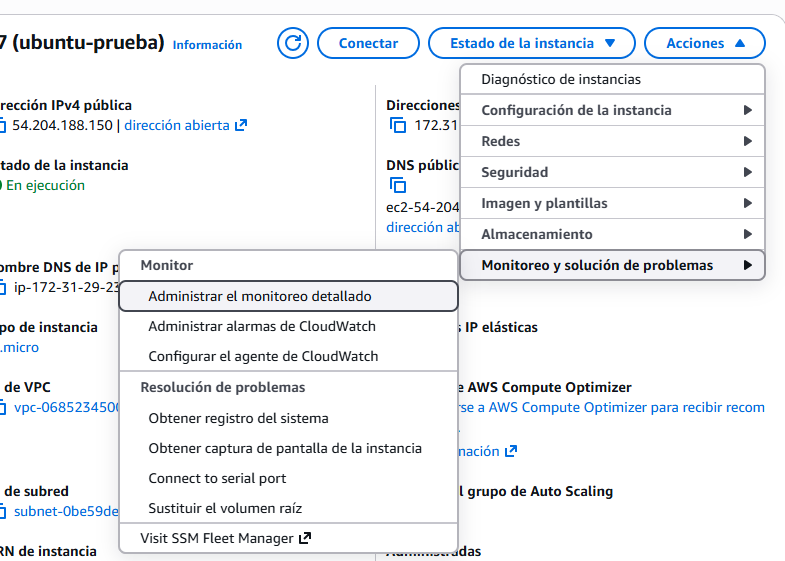
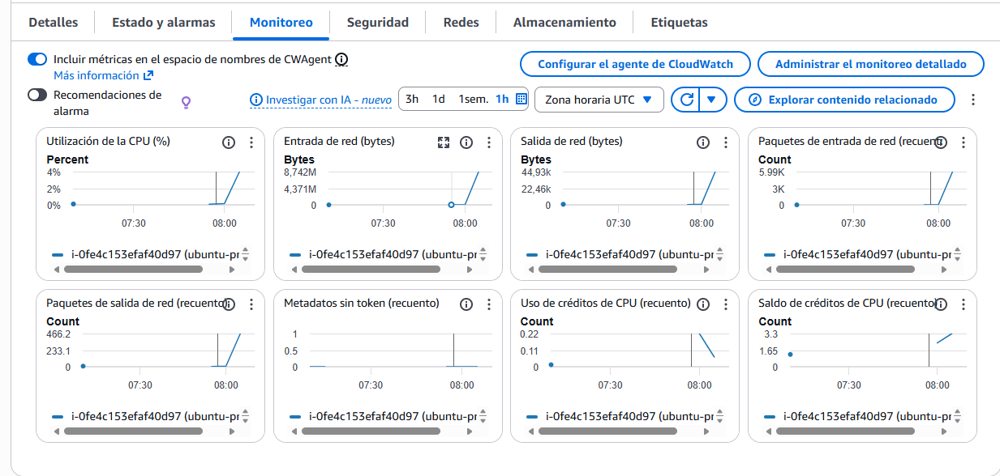
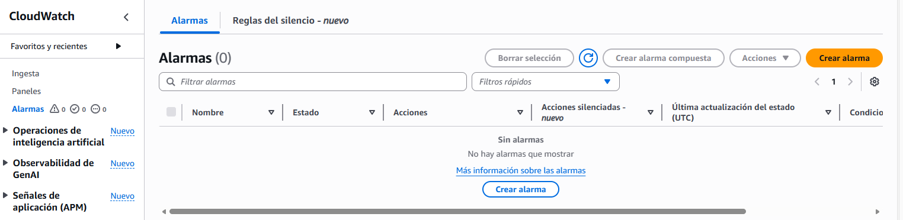

Idea principal de monitoreo para EC2

1. EC2 genera métricas (CPU, red, etc)
2. Cloudwatch mide la carga
3. Si la carga supera un umbral, Cloudwatch lanza una alarma
4. La alarma ejecuta una Lambda
5. Lambda puede:
    - Guardar un registro
    - Enviar un mensaje a SQS
    - Guardar logs
    - Enviar un correo con SNS (probar ya que no se si se podrá en mi labroratorio)

### Métricas de EC2 (CPU, red, disco)
La instancia EC2 envía datos cada 5 minutos o 1 min

Métricas básicas utilizadas:
- CPUUtilization
- NetworkIn o NEtworkOut (para medir peticiones sin monitorizar logs)
- StatusCheckFailed (sirve si el servidor se cae)

Seleccionar intancia EC2
Pestaña Monitoring 
Ver graficos
(Apartado que podemos ver en monitoreo detallado)

### Cloudwatch Alarms

Esto es una alarma que revisará una métrica y actúa cuando supere un valor

CPU > 80% dirante 2 mins -> dispara alarma

Cómo crear una alarma?

1. Entrar en AWS CloudWatch
2. Entrar en alarmas (menú de la izquierda)

3. Crear alarma
