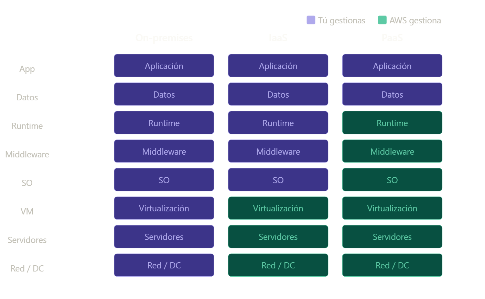
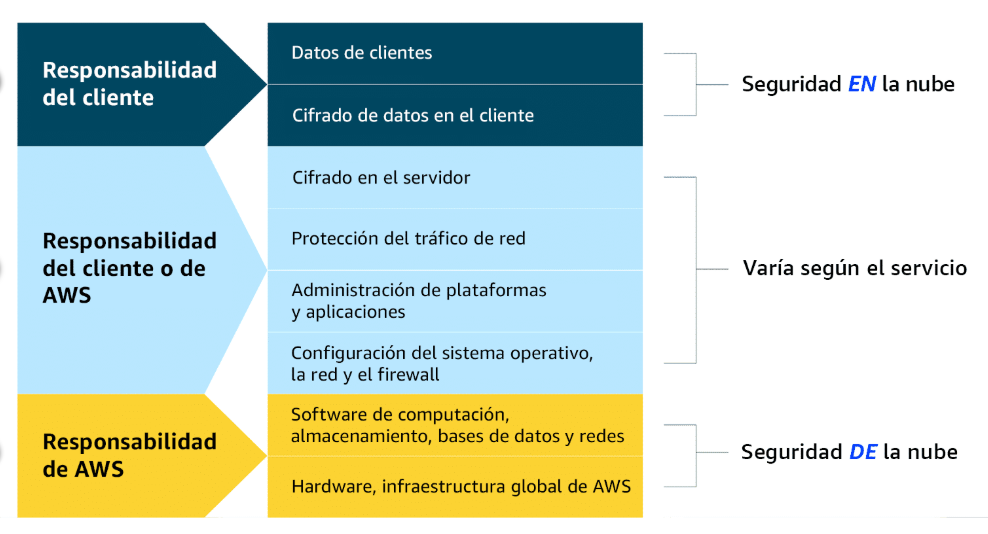

# Qué es la computacion en la nube
- Entregar recursos informáticos bajo demanda a través de internet, con precios de pago por uso. 
- Ideas principales: bajo demanda, a través de internet y pago por lo que consumes

- Aws en contraste al termini "On-premises" que se refiere a tú compras los servidores, los instalas, los mantines y si necesitas mas capacidad... deberas esperar. En cambio con AWS puedes hacerlo en minutos gracias a la nube.

#### Modelos de servicio
- Copnceptos: IaaS, PaaS y SaaS
- IaaS (Infraestructura como servicio): Proporciona recursos de infraestructura bajo demanda (servidores, almacenamiento, redes) donde el usuario tiene control total sobre el sistema operativo y las aplicaciones, pero el proveedor gestiona el hardware físico. 
PaaS (Plataforma como servicio): Ofrece un entorno completo para el desarrollo, ejecución y gestión de aplicaciones, permitiendo a los desarrolladores centrarse en el código sin preocuparse por la gestión de la infraestructura subyacente. 
SaaS (Software como servicio): Entrega aplicaciones de software completas listas para usar a través de internet, donde el proveedor se encarga de todo, desde el hardware hasta el mantenimiento y las actualizaciones, dejando al usuario solo con la gestión de sus datos. 

- Cuánto más arriba en el modelo más control tienes tú, cuanto más abajo más gestiona AWS. Aquí falta el modelos SaaS donde lo gestiona todo AWS y tu solo usas la aplicacion (ejemplo: Gmail, SalesForce).
- Ejemplos de AWS: EC2 = IaaS, Elastic Beanstalk = PaaS, Amazon Workmail = SaaS

#### Tipos de despliegue en la nube (Cloud deployment types)

1. Cloud 
- El modelo da la flexibilidad de migrar recursos existentes a la nube, diseñar, desarrollar nuevas aplicaciones en un entorno cloud 
- Ejemplo: Una empresa migra sus recursos e datos a la nube y desarrolla una aplicacion compuesta por varios servidores virtuales, bases de datos y componentes red alojados en la nube

2. On-premises / local
- Implementar recursos en las instalaciones de la empresa mediante herramientas de virtualizacion y gestión de recursos. Se busca proporcionar recursos dedicados y de baja latencia (localmente en la empresa)
- Es similar a la infraestructura TI tradicional aunque utiliza tecnologías para la gestión de aplicaciones y virtualizacion para aumentar la utilizacion de los recursos

3. Híbrido
- Los recursos en la nube y la infraestructura local trabajan conjuntamente. Ideal para situaciones donde las aplicaciones deben estar en las instalaciones debidoa a preferencias de mantenimiento o requisitos formativos
- Ejemplo: Una empresa conserva aplicaciones en sus instalaciones, mientras utiliza servicios en la nube para el procesamiento y análisis de datos

#### Beneficios de utilizar AWS

1. Cambiar gastos fijos por gastos variables
- Con aws el coste por los recursos es variable, solo pagas por los recursos que necesites. A diferencia que un centro de datos tradicional que necesita invertir una gran cantidad de dinero por espacio físico, hardware, personal y mantenimiento que supone un coste fijo .
2. Economia de escala masiva
- AWS compra una gran cantidad de hardware, debido a esto se adquiere un precio más bajo y luego se traslada esos sotes al cliente
3. Dejar de estimar la capacidad
- En un centro de datos tradicional compra hardware suficiente para provisionar "x" usuarios durante "x" años. El problema es que cuando escala el número de usuarios el hardware que se compró no es suficientey esto puede suponer grandes problemas. Con aws no se necesita estimar la capacidad ya que el escalado es cuestion de minutos. Se pueden utilizar mecanismos de escalado para aumentar o disminuir estos recursos segun la demanda.
4. Mayor velocidad y agilidad
- Mejor ancho de banda para probar cosas nuevas. Se pueden crear entornos de pruebas y realizar experimentos para nuevas formas de resolver porblemas. Si estas pruebas no funcionan se pueden eliminar los recursos y dejar de incurrir en costes.
5. Deja de gastar dinero en ejecutar y mantener centros de datos
- AWS facilita el coste de ejecutar y mantener servidores. Esto significa que en lugar de gastar tiempo y recursos en servidores puedes enfocarte más en los clientes
6. Globalízate en minutos
- Puedes implementar tus aplicaciones en diferentes regiones que es administrada por aws. Tradicionalmente expandirte a otras regiones supone mucho dinero y tiempo.

#### Introduccion a la infraestructura global de aws
- La alta disponibilidad: consiste en asegurarse en que tus aplicaciones permanecen accesibles minimizando el tiempo de inactividad.
- Tolerancia a fallos: diseña un sistema que continue operando incluso si fallan diferentes componentes
- Regiones en aws: Zaragoza, Tokio, Sao Paulo, Virginia, París y Milán
- Regiones: ubicaciones físicas repartidas por el mundo que contienen centros de datos, estas se denominan zonas de disponibilidad AZs
- Dentro de cada region Tenemos las zonas de disponibilidad (AZs) Availability Zones. Hay un minimo de 3 AZs eb cada region para tener redundancia y suelen estar conectadas entre sí a varios km pero no lejos para tener baja latencia. En cada AZ hay 1 o más centro de datos hablititados con energía, redes o mconectividad redundatntes.

#### Modelo de responsabilidad compartida de aws
- Responsabilidades de la clientela, las responsabilidades de AWS y las reponsabilidades compartidas en la nube de AWS y sus diferencias

- AWS = Seguridad DE la nube
- Cliente = Seguridad EN la nube

1. Responsabilidad del cliente: el cliente es responsable de gestionar los requisitos de seguridad de sus datos, incluidos los datos que almacena en aws y quien accede a ellos. Además es responsable del cifrado en el cliente.
2. Responsabilidades compartidas: Según el servicio utilizado, las responsabilidades pueden cambiar entre el cliente y AWS. Los componentes como el cifrado del lado del servidor, la protección del tráfico de red, la administración de plataformas y aplicaciones y la configuración del sistema operativo, la red y el firewall varían según el servicio en cuanto a quién es responsable de estos elementos
3. Responsabilidades de AWS: Es responsabilidad de AWS proteger la infraestructura que ejecuta todos los servicios que se ofrecen en la nube de AWS. Esta infraestructura se compone del hardware, software, redes e instalaciones que ejecutan los servicios de la nube de AWS.

#### Aplicacion de los conceptos de la nube a casos practicos reales
- Conceptos a tratar: infraestructura global en aws y modelo de responsabilidad compartida en aws
- Estos conceptos en aws trabajan de manera conjunta para una solución empresarial. Como ejemplo una empresa global de comercio electronico ha desplegado recursos en varias regiones y zonas de diponibilidad (Regiones como en Irlanda y Singapur) que esto supone dos zonas de disponibilidad. El despliegue en varias regiones aumenta la alta disponibilidad y la tolerancia a errores mediante el despliegue en dos zonas de disponibilidad. La eampresa no debe preocuparse en proteger el centro de datos ya que es responsabilidad de aws el proteger la infraestructura física. Solo debe preocuparse en proteger y cifrar sus datos dentro de sus recursos en la nube.