# Amazon EC2 Amazon Elastic cloud

### Introduccion a Amazon EC2
1. Altamente flexible 
2. Rentable
3. Rápido

- Multitenencia: Compartir hardware subyacente entre maquinas virtuales
- Un mismo ordenador tendra muchas maquinas virtuales
- Cada máquina virtual está aislada, pero comparte los recursos de una maquina host

#### Configuraciones de Amazon EC2
1. Windows
2. Linux
3. Aplicaciones internas de negocio
4. Aplicaciones Web
5. Bases de datos
6. Software de terceros

- Escalamiento vertical: Se refiere a una instancia que requiere más recursos, puedes modificarla teniendo más memoria y más CPU
- Controlas el aspecto de redes en Amazon EC2
- Modulo como cómputo de servicio

#### Diferencias clave entre administración de recursos locales y en la nube
##### Recursos locales
1. Tienes que comprar hardware por adelantado
2. Esperar la entrega
3. Instalar los servidores en tu centro de datos 
4. Realizar las configuraciones necesarias
- Este proceso es caro e inflexible

##### Recursos en la nube
1. Paga solo por el tiempo de computación utilizado cuando se ejecuta una instancia
2. Aprovisionar e iniciar ina instancia en cuestion de minutos
3. Deja de usar instancias ina vez hayas completado una carga de trabajo
4. Escala o desescala verticalmente en funcion de la demanda 
-Puedes iniciar, escalar y detener instancias segun las necesidades
- Sin demoras y costes iniciales 

#### Como funciona Amazon EC2 
1. Iniciar una instancia
- Selecionas una imagen para la maquina (AMI) esta define el sistema operativo y puede incluir software adicional. También eliges el tipo de instancia, que determina los recursos hardware que tendrá, como el rendimiento de la CPU, la memoria y la red
2. Conectar con la instancia
- Puedes conectarte a una instancia de EC2 de varias formas. Las aplicaciones pueden interactuar con los servicios que se ejecutan a través de la red.
- Los usuarios o administradores se conectan mediante SSH para instancias Linux o el protocolo RDP para instancias Windows. 
- Como alternativa los servicios de AWS tye permiten conectarte con AWS Systems Manbager que ofrece un método seguro y simplificado para acceder a las instancias
3. Usar la instancia
- Una vez estés conectado a la instancia puedes usarla para ejecutar comandos, instalar software, añadir almacenamiento, organizar archivos y realizar otras tareas.

### Tipos de instancia de Amazon EC2
- Cada tipo de instancia de Amazon EC2 se agrupa en una familia de instancias (son 5 familias),según CPU,  memoria y capacidad de red
- Tipos de familias: 
1. Uso General
2. Optimizacion para la computación
3. Optimizadas para memoria
4. Optimizadas para almacenamiento
5. Computación acelerada

#### Uso general
1. Proporciona equilibrio de recursos 
2. Diversas cargas de trabajo
3. Servicios Web
4. Repositorios de código
- Ideales para distintos tipos de cargas de trabajo, como servicios web, repositorios de código o en casos donde el rendimiento de la carga de trabajo es impredecible.
#### Optimizadas para computación
1. Tareas de alto procesamiento computacional
2. Servidores de juegos
3. Computacion de alto rendimeinto (HCP)
4. Modelado científico
- Son perfectas para tareas con uso intensivo de computación, como servidores de juegos, computación de alto rendimiento (HPC), machine learning y modelado científico.
#### Optimizadas para memoria
1. Tareas intensivas de memoria
- Se utilizan en tareas que consumen mucha memoria, como el procesamiento de grandes conjuntos de datos, el análisis de datos y las bases de datos. Proporcionan un rendimiento rápido para cargas de trabajo que requieren mucha memoria.
#### Computación acelerada
1. Cálculos con números de punto flotante
2. Procesamiento gráfico
3. Coincidencia de patrones de datos
4. Aceleradores de hardware
- Utilizan aceleradores de hardware, como las unidades de procesamiento de gráficos (GPU), para gestionar tareas de manera eficiente, como los cálculos de punto flotante, el procesamiento de gráficos y el machine learning.
#### Optimizadas para almacenamiento
1. Alto rendimiento para datos almacenados localmente
- Diseñadas para cargas de trabajo que requieren un alto rendimiento para datos almacenados de forma local, como bases de datos grandes, almacenamiento de datos y aplicaciones con uso intensivo de E/S.

### Cómo aprovisionar recursos de AWS
- Cómo usar la consola de administracion de AWS, interfaz de línea de comandos (AWS CLI) y AWS SDK para interactuar con los servicios de AWS
- Responsabilidades de tu cliente y de AWS en relacion con las máquinas virtuales
- Diferencias entre los servicios administrados y los que no
- Las API interactuan con los recursos de aws para administrar y configurar de manera eficiente. Tres formas de llamar a las API de AWS:
- API (Application programming interface)
#### Interaccion con servicios de AWS 
1. Condola de aministración de AWS
2. Interfaz de línea de comandos de AWS (CLI)
3. Kit de desarrollo de software de AWS (SDK)

##### Consola de administracion de AWS
1. Configurar entornos de prueba
2. Ver facturas de AWS
3. Ver entorno de monitoreo
4. Trabajar con recursos no técnicos
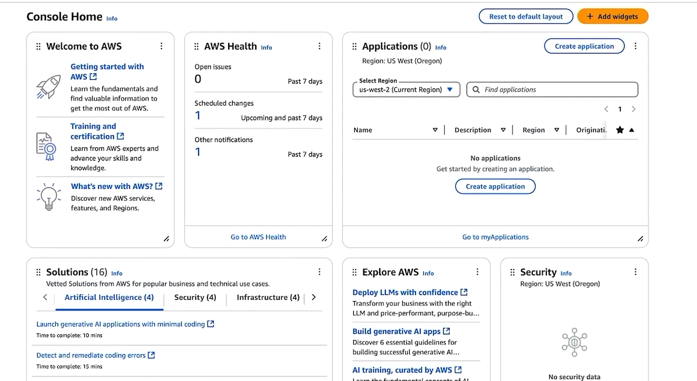
- Ideal para usuarios que prefieren una interfaz visual y fácil de usar para administrar y configurar los servicios de AWS.

#### Interfaz de línea de comandos CLI
- Para evitar como ejemplo, crear una instancia de manera gráfica se utiliza CLI
- AWS Command Line Interface: Realiza llamadas a la API utilizando la terminal de su máquina
- Te permite interactuar con los recursos de AWS con la línea de comandos
- Se puede interactuar directamente en la Cloud shell. En el siguiente ejemplo creamos una instancia:
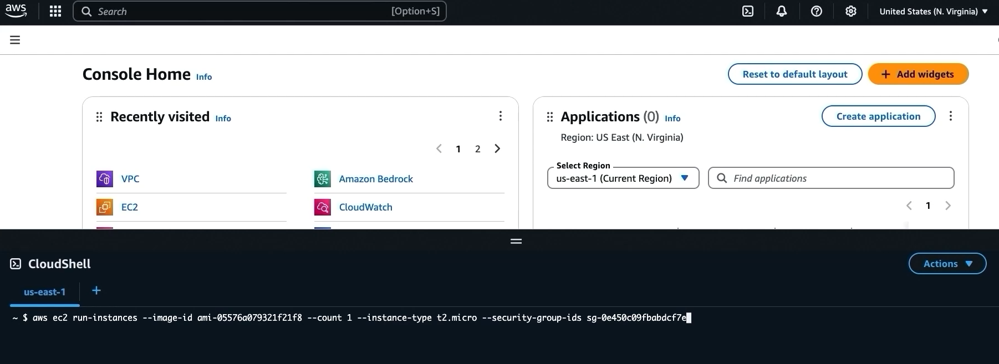
- Otro ejemplo básico, listaremos las zonas de disponibilidad en la región actual:
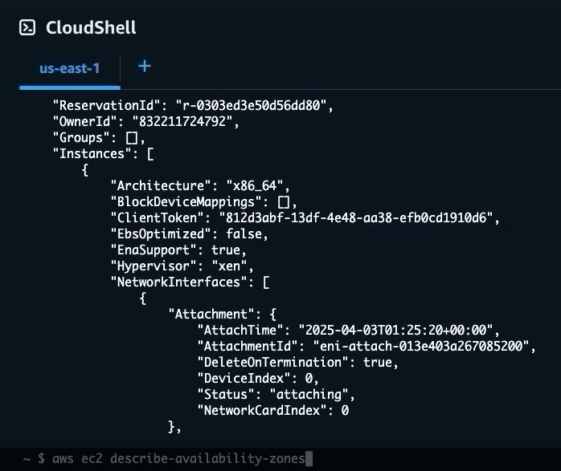

- Es importante ya que se puede automatizar tareas mediante scripting
- Ideal para desarrolladores y usuarios avanzados que necesitan automatizar tareas, crear scripts de acciones y administrar los recursos de AWS de manera eficiente desde la línea de comandos.

#### AWS Software Development Kit (SDK)
- Interactúa con los recursos de AWS a través de diversos lenguajes de programación (como pyhton)
- Aquí muestro un ejemplo de como con un script de python interactúa con SDK para listar las intancias de EC2 en la región actual
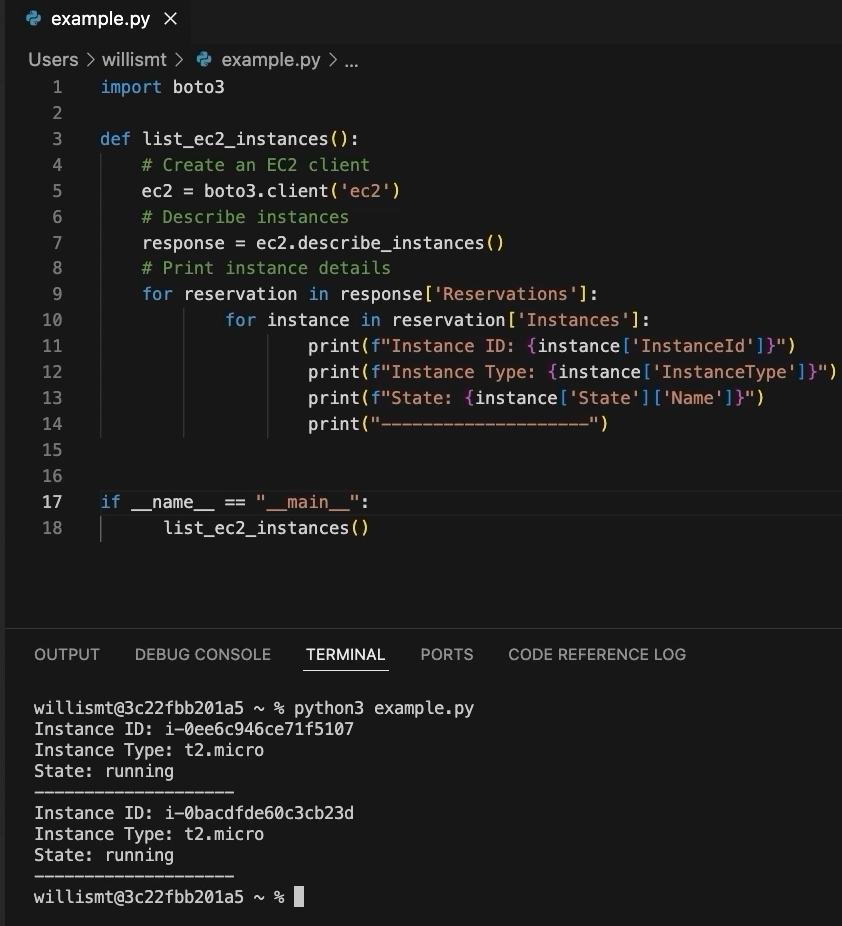

- Ideal para desarrolladores que desean integrar los servicios de AWS en sus aplicaciones mediante API específicas para cada lenguaje.

#### Computación y responsabilidad compartida
- El modelo de responsabilidad compartida describe las funciones entre cliente y AWS. AWS se encarga de la seguridad en la nube (hardware e infraestructura) y el cliente de la seguridad en la nube (aplicaciones, datos, control de acceso). Por ejemplo una EC2 eres responsable de configurar ka seguridad, administrar el sistema operativo, aplicar actualizaciones y configurar los firewalls (grupos de seguridad).
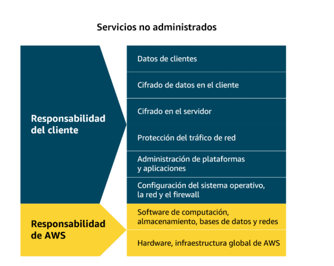

### Inicio de una instancia de Amazon EC2
- Configuraciones clave necesarias 
- Una AMI mantiene coherencia y eficiencia al escalar las aplicaciones

1. Lanzar una instancia: desde la consola de administracion de aws
2. Poner nombre de la instancia
3. Elegir la imagen que usaremos AMI
4. Elegir el tipo de instancia: se refiere a cuanta potencia de computación tendrá nuestra instancia
5. Par de claves (para conectarse por ssh), se podrá elegir crear una nueva o usar una ya existente
6. Configuraciones de red (firewall), aquí definiremos que tráfico podemos permitir o denegar
7. Tipo de almacenamiento: definiremos el espacio en disco de nuestra instancia
8. En la configuración avanzada nos permite meter un script a nuestra máquina para que venga ya configurada como queramos (por ejemplo una maquina que sirva como servidor web)

- Con esto ya podremos conectarnos a nuestra máquina EC2
#### Imagenes de máquina de Amazon (AMI)
- Son imagenes de máquina virtual ya prediseñadas que tienen los componentes básicos.
##### Componentes de la AMI
- Una AMI incluye un sistema operativo, la configuración del almacenamiento, el tipo de arquitectura, los permisos de inicio y cualquier software adicional que ya esté instalado. También se puede utilizar una AMI para iniciar instancias de EC2 que tengan la misma configuración
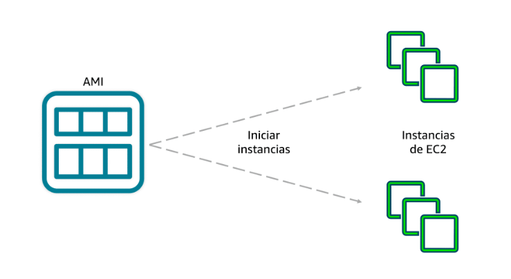
##### 3 Maneras de usar las AMI
1. Puedes generar una personalizada, con configuraciones y software específicos adaptads a tus necesidades
2. Puedes usar las AMI de AWS preconfiguradas, que están preparadas para sistemas operativos y software habitual
3. Puedes comprar AMI en AWS Marketplace donde los proveedores externos ofrecen software especializadoi diseñado para casos prácticos específicos

##### Repetibilidad de AMI
Las AMI ofrecen repetibilidad a través de un entorno uniforme para cada nueva instancia. Las configuraciones son idénticas y los despliegues están automatizados, los entornos de desarrollo y prueba son coherentes. Esto ayuda a escalar, reduce errores y agiliza la administracion de entornos a gran escala.

### Precios de Amazon EC2
- Opciones de precios de Amazon EC2 disponibles
- Cuándo usar cada opción según casos prácticos especificos
- En qué consisten las reservas de capacidad de Amazon EC2 y la flexibilidad de las instancias reservadas (RI)

#### Opciones de compra de Amazon EC2
- Bajo demanda
- Savings Plans
- Instancias Reservadas
- Instancias Spot
- Host dedicados

1. Bajo demanda: Paga solo por la capacidad de computación que consumes. No hay que hacer pagos anticipados ni se exigen compromisos a largo plazo
2. Savings Plans: Ahorra hasta un 72% en distintos tipos de instancias y servicios al optar por un uso regular durante 1 o 3 años
3. Instancias reservadas: Obtén un ahorro de hasta un 75% si te comprometes a un plazo de 1 o 3 años para cargas de trabajo predecibles con familias de instancias y regiones de AWS específicas
4. Instancias Spot: Realiza una oferta por la capacidad de computación sobrante con un descuento de hasta un 90% sobre el precio bajo demanda con flexibilidad de poder interrumpirla cuando AWS recupere la instancia
5. Host dedicados: reserva un servidor físico. Esta opción permite control total y es ideal para cargas de trabajo con requisitos estrictos de seguridad o licencias
6. Instancias dedicadas: Paga por las instancias que se ejecuten en hardware dedicado exclusivamente a tu cuenta. Esta opción permite aislarte de otras empresas en AWS

##### Instancias dedicadas
Los hosts dedicados ofrecen un uso exclusivo de servidores físicos y brindan un control total sobre la ubicación de las instancias y la asignación de recursos. Esto los hace ideales para cargas de trabajo orientadas a la seguridad o el cumplimiento.
las instancias dedicadas proporcionan aislamiento sin que tengas que elegir en qué servidor físico se ejecutan. Los hosts dedicados te ofrecen un servidor físico completo para uso exclusivo, lo que brinda un control total sobre la ubicación de las instancias y la asignación de los recursos.
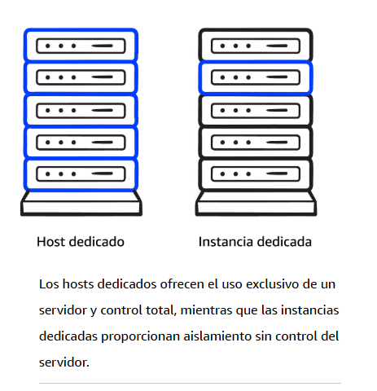

##### Información sobre la optimización de costes
- Savings Plans: Ideal para cargas de trabajo predecibles
Ofrecen descuentos con tarifas bajo demanda a cambio del compromiso de usar una cantidad específica de potencia de computación durante 1 o 3 años. Ofrecen precios flexibles para el uso de Amazon EC2, AWS Fragate, AWS Lambda y Amazon SageMaker AI. Independientemente del tipo de instancia o de la región. Las opciones de pago incluyen Pago total, Parcial anticipado y Sin anticipo

- Reservas de capacidad: ideal para cargas de trabajo críticas con requisitos de capacidad estrictos
Reservas la capacidad de computación en una zona de disponibilidad específica para cargas de trabajo críticas. Estas se cobram de acuerdo con la tarifa bajo demanda, tanto si se utilizan como si no. Solo pagas por las instancias que ejecutas .

- Flexibilidad de instancia reservada: Ideal para cargas de trabajo estables con uso predecible
Ofrecen hasta un 75 % de ahorro con respecto a los precios bajo demanda al aplicar descuentos en todos los tamaños de instancia y en varias zonas de disponibilidad dentro de una región. Al adquirir una instancia reservada (RI), AWS aplica automáticamente el descuento a otros tamaños de instancias de la misma familia en función del tamaño de la instancia. También aplica el descuento en varias zonas de disponibilidad para mejorar la distribución de los recursos y la tolerancia a errores.

### Escalado de Amazon EC2
- Qué son la escalabilidad y elasticidad aplicados a AWS
- Cómo ayuda AWS a las empresas a ajustar la capacidad de computación en función de las diferentes demandas

#### Escalabilidad y elasticidad
- Escalabilidad: es la capacidad de un sistema para gestionar un aumento de carga mediante la incorporación de recursos. Puedes escalar verticalmente al incorporar más potencia a las máquinas existentes o puedes escalar horizontalmente añadiendo más máquinas. La escalabilidad se centra en la planificación de la capacidad a largo plazo para garantizar que el sistema pueda expandirse y adaptarse a más usuarios o cargas de trabajo cuando sea necesario
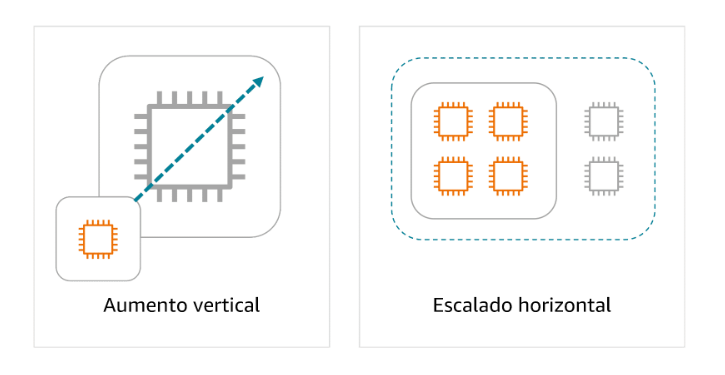

- Elasticidad: Es la capacidad de ampliar o reducir automáticamente los recursos en respuesta a la demanda en tiempo real. El sistema ajusta los recursos, escalando de forma horizontal durante periodos de alta demanda y desescalando cuando esta disminuye.

Escalado verical: darle más pòtencia por cada máquina, de esta manera tiene más capacidad de calculo para realizar el trabajo
Escalado horizontal: añadir máquinas para el procesado de pedidos/peticiones
Para recopilar todos los datos de monitorización de las maquinas se utiliza AWS CloudWatch

#### Amazon EC2 Auto Scaling
Ajusta automáticamente la capacidad de instancias de EC2 en función de la demanda de las aplicaciones lo que mejora la disponibilidad. 
Escalado dinámico: ajusta en tiempo real el número de instancias a las fluctuaciones de la demanda
Escalado predictivo: programa de forma preventiva el número correcto de instancias en función de la demanda

- Ejemplo Amazon EC2 Auto Scaling
Puedes crear grupos de escalamiento automático, que son colecciones de instancias de EC2 que pueden escalar o desescalar horizontalmente.
Un grupo de escalamiento automático se configura con los tres ajustes clave:
1. Capacidad mínima: es la cantidad mínima de instancias de EC2 necesarias para mantener una aplicación en ejecución. Esto garan tiza que nunca desescale por debajo de ese umbral. Es la cantidad de instancias EC2 que se inician de inmediato tras crear el grupo de escalamiento automático
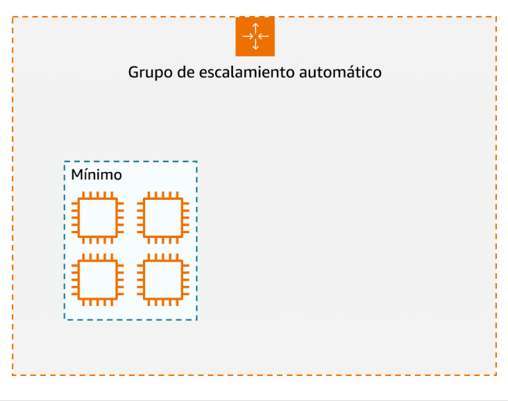
2. Capacidad deseada: es la cantidad ideal de instancias necesarias para gestionar la carga de trabajo actual que Auto Scaling pretende mantener. Si no se especifica el número de instancias EC2 en un grupo de escalamiento automático, la capacidad deseada se establece de forma predeterminada a la capacidad mínima
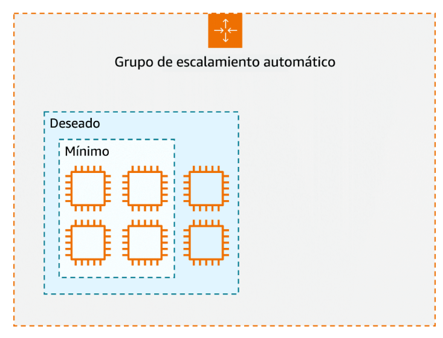
3. Capacidad máxima: establece un límite supoerios a la cantidad de instancias que pueden iniciar, lo que evita el escalado excesivo y controla costes. Se puede configurar un escalamiento automático para que escale horizontalmente cuando se produzca un aumento de demanda. 
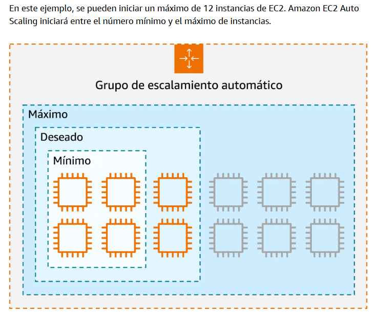

### Direccion de tráfico con Elastic Load Balancing
- Distribución del tráfico y la escalabilidad en los entornos de AWS
- Beneficios de Elastic Load Balancing (ELB) en AWS
- Relación entre Amazon EC2 Auto Scaling y ELB en la administración de recursos de AWS
Con Elastic Load Blancing hablamos de un balanceador de carga

#### Elastic Load Balancing
Distribuye automáticamente el tráfico de entrada de la aplicacion entre varios recursos como instancias EC2, para optimizaar el rendimiento y la fiabilidad. También sirve como como único punto de contacto de todo el trafico web que entra en un grupo de escalamiento automático.
ELB y Amazon Auto Scaling son servicios distintos pero funcionan en conjunto para mejorar el rendimeinto de las aplicaciones y asegurar una alta disponibilidad

##### Beneficios ELB 
- Distribucion eficiente del tráfico: evita la sobrecarga en cualquier instancia y optimiza la utilizaciuón de recursos distribuyendo uniformemente el tráfico entre las instancias EC2.
- Escalado automático: Hace ajustes automáticos según el tráfico y los cambios en la demanda para asegurar un funcionamiento fluido a medida que se añaden o eliminan instancias de backend
- Administración simplificada: separa frontend y el backend y reduce la sincronización manual. Gestiona el mantenimiento, las actualizaciones y la conmutación por error para aliviar la sobrecarga operativa.

#### Métodos de enrutamiento
ELB optimiza la distribución del tráfico con metodos de enrutamiento: round robin, conexión mínima, hash de IP y tiempo de respuesta mínimo. Estas estrategias logran una administración eficiente del tráfico y rendimiento óptimno para las aplicaciones
- Round Robin: Distribuye el tráfico de manera uniforme entre todos los servidores
- Conexión mínima: Mantiene una carga equilibrada dirigiendo el tráfico al servidor con el menor número posible de conexiones activas
- Hash de IP: usa la direccion IP de una persona para enrutar el tráfico de maner uniforme al mismo servidor
- Tiempo de respuesta mínimo: Dirige el tráfico con el tiempo de respuesta más rápido  lo que minimiza la latencia.

### Mensajería y colas
- Amazon Simple Queue Service (Amazon SQS) facilita la puesta en cola de mensajes
- Amazon Simple Service (Amazon SNS) utiliza un modelo de publicación y suscripción para distribuir los mensajes
- Cuál es la diferencia entre arquitecturas de acoplamiento estrecho y de acoplamiento débil
- Cómo las coilas de mensajes ayudan a mejorar la comunicación entre los componentes

Arquitectura estrechamente acoplados
Aquí un ejemplo de como interactúa un aplicacion con otra co n un débil acoplamiento:
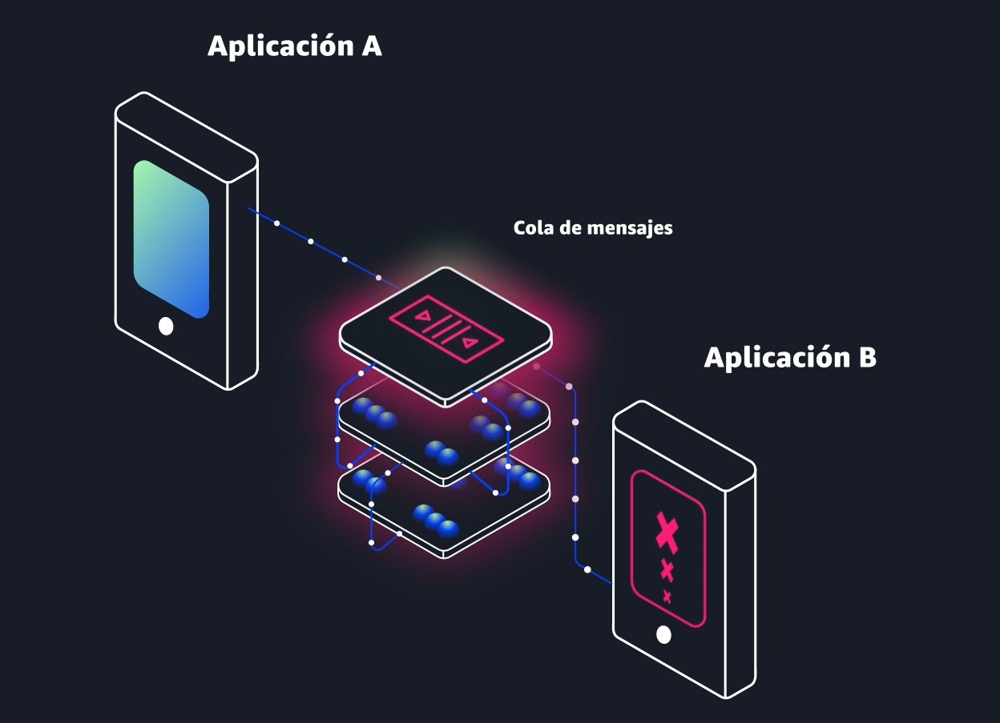

#### Amazon Sqs
Hace posible:
- Enviar mensajes
- Almacenar mensajes
- Recibir mensajes
Entre componentes software
A esto lo llamamos cola SQS. (tablero de pedidos en una cafetería)
Los datos dentro de un mensaje se llaman: Carga útil
Carga útil: Datos contenidos en un mensaje
Colas de Amazon SQS: Lugar donde se almacenan los mensajes hasta que se procesan

Amazon SNS: Un canal para la entrega de mensajes (Es la persona que dice directamente el pedido que le han pedido en la cafetería)
Los mensajes no se guardan hasta que el servicio de procesamiento, necesitan una respuesta inmediata

#### Servicios de desacoplamiento
- Aplicaciones monolíticas: están formadas por componentes que funcionan en conjunto para transmitir datos, cumplir solicitudes y mantener la aplicación funcionando. En un enfoque tradicional de la arquitectura de aplicaciones, los componentes, como la lógica de la base de datos, los servidores de aplicaciones web, las interfaces de usuario y la lógica empresarial, están estrechamente relacionados. Esto implica que, si un componente falla, puede provocar el error de otros, lo que podría derivar en la caída de toda la aplicación.
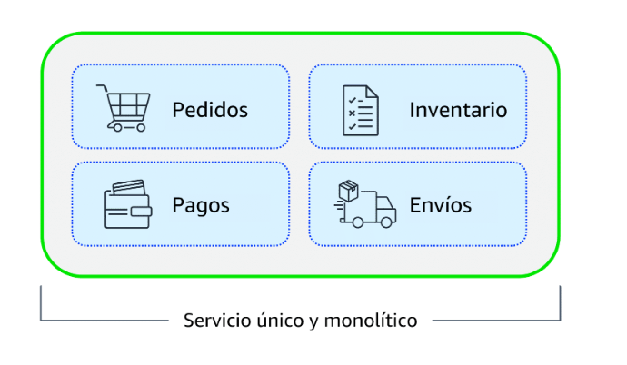

- Arquitectura de microservicios: los componentes de la aplicación tienen un acoplamiento débil, lo que significa que, si un componente falla, los demás siguen funcionando con normalidad. La comunicación entre los componentes permanece intacta y el error de un único componente no afecta a todo el sistema. Este diseño promueve una mayor flexibilidad y fiabilidad en la aplicación.
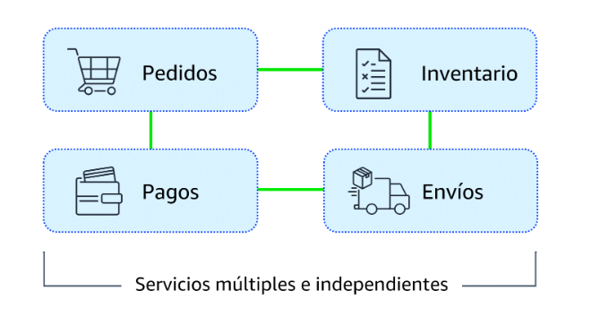

#### Respaldar una comunicación den la nube escalable y fiable
Amazon EventBridge, Amazon SNS y Amazon SQS son servicios de AWS que facilitan una comunicación eficaz en la nube entre las distintas partes de una aplicación. Estos servicios ayudan a desarrollar sistemas basados en mensajes y eventos. Ayudan a crear aplicaciones escalables y fiables para gestionar el tráfico y mejorar la comunicacion entre los componentes

- EventBridge: es un servicio sin servidor que permite conectar partes de una aplicacion con eventos, lo que ayuda a crear sistemas escalables y basados en eventos. Puedes redirigir los eventos a donde quieras.
Ejemplo: Un cliente pide comida a través de un servicio de alimentos en línea.
1. Procesamiento de pagos: El servicio de pago debe verificar y procesar el pago
2. Notificación al restaurante: recibe una notificación para empezar a preparar la comida
3. Administración de inventarios: El sistema de inventario comprueba si los ingredientes del pedido están disponibles
4. Envío del pedido: Se notifica al repartidor para que recoja y entregue la comida
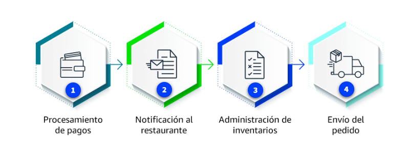

- Amazon SQS: servicio de cola de mensajes que facilita la comunicación fiable entre los componentes de software. Puede enviar, almacenar y recibir mensajes asegurandose de que estos mensajes no se pierdan y de que no sea necesario otros servicios para su procesamiento.

Ejemplo: El agente de soporte es la persona responsable de recibir las incidencias del cliente y el especialista técnico trabaja para resolverlas. Este proceso funciona bien siempre que tanto el agente como el especialista estén disponibles y se coordinen.
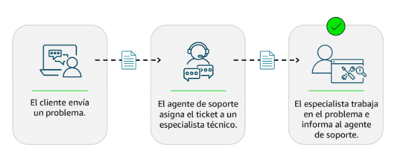
Desafío: Sin embargo, ¿qué ocurre si el agente de soporte crea un ticket, pero el especialista técnico tiene su atención en otra incidencia o no está disponible? El agente tendría que esperar hasta que el especialista pudiera aceptar el nuevo ticket, lo que provocaría retrasos en la resolución de las incidencias de los clientes y los dejaría esperando más tiempo. A medida que aumenta el volumen de incidencias, este proceso se vuelve ineficiente.
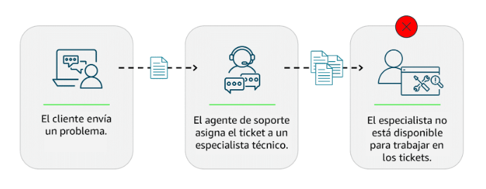
Solución: Para mejorar la eficiencia, implementan un sistema de colas con Amazon SQS. El agente de soporte añade las incidencias a la cola, lo que crea una tarea pendiente. Aunque el especialista está ocupado, el agente puede seguir añadiendo nuevas incidencias. El especialista comprueba la cola, resuelve las incidencias y pone al día al agente. Este sistema proporciona un flujo de trabajo fluido y ayuda a gestionar volúmenes más altos sin demoras ni cuellos de botella.
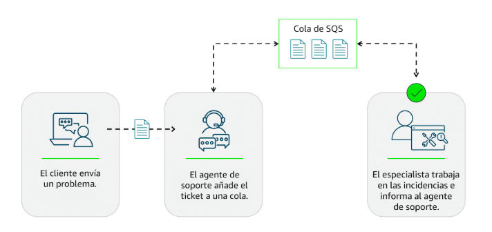

- Amazon SNS: servicio de publicación y suscripción que los editores utilizan para enviar mensajes a los suscriptores a través de temas de SNS. En Amazon SNS, los suscriptores pueden incluir servidores web, direcciones de correo electrónico, funciones de Lambda y otros puntos de enlace
Ejemplo: una empresa que vende una variedad de productos envía un único correo electrónico a toda la clientela con actualizaciones sobre diversos temas, como nuevos productos, ofertas especiales y próximos eventos. Si bien este método funcionó al principio, la clientela solo quiere recibir las actualizaciones que le interesa. Este correo electrónico general está provocando insatisfacción entre sus clientes y una menor participación.
Solución: 
1. Segmentar la comunicación: divide la comunicación en tres temas distintos, uno para nuevos productos, otro para ofertas especiales y otro para eventos.
2. Permitir que elijan los temas: las personas se suscriben a los temas que les interesa; Una persona se puede suscribir solo a las novedades sobre los últimos productos.
3. Enviar notificaciones personalizadas: la empresa puede enviar notificaciones personalizadas a los suscriptores en función de sus intereses específicos. Amazon SNS garantiza que estas notificaciones se envíen a la audiencia correcta, lo que mejora la eficiencia y la relevancia de la comunicación.
