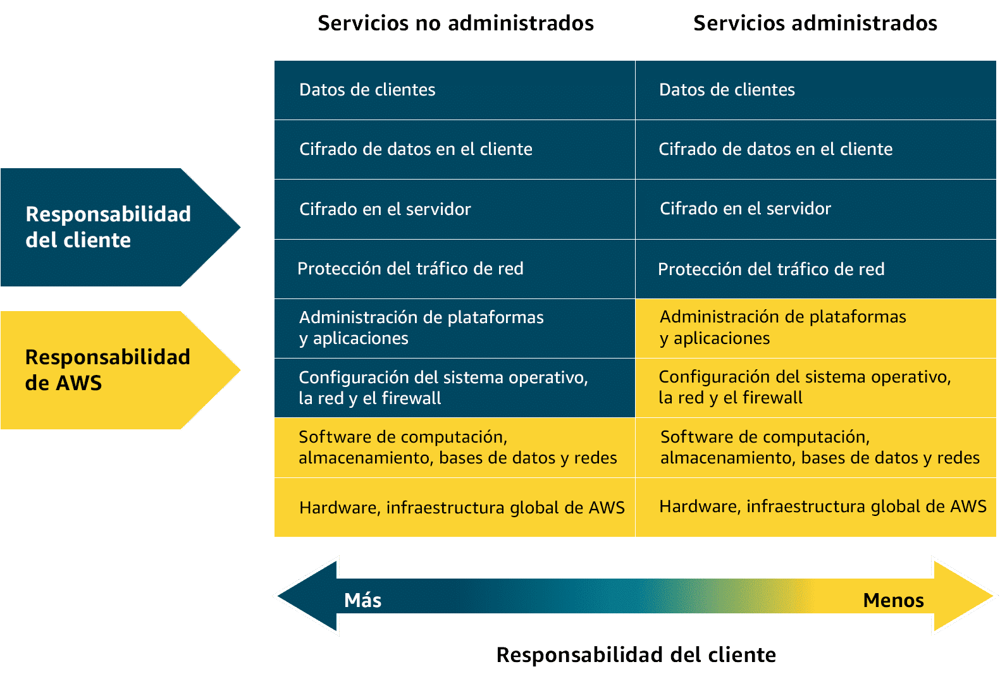
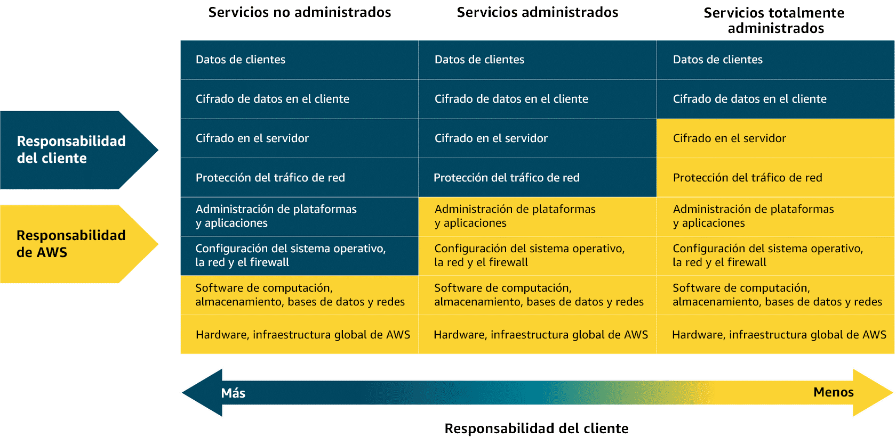
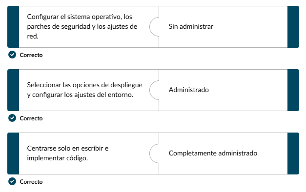
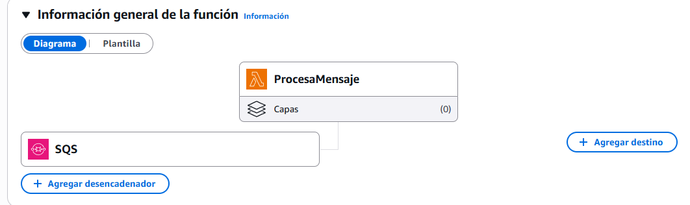
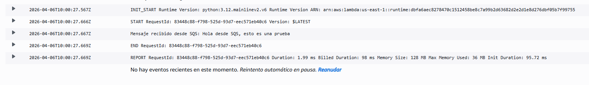
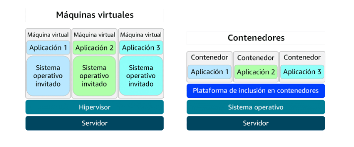
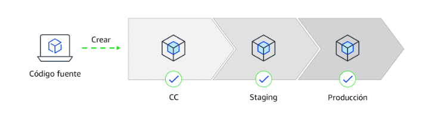
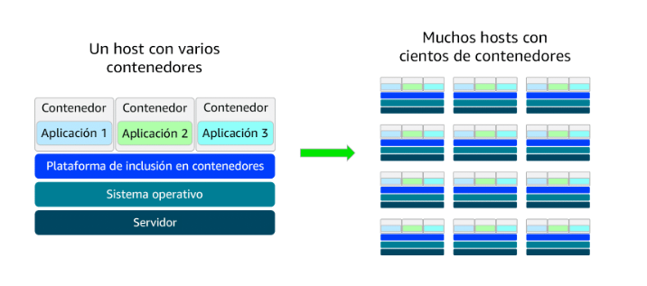
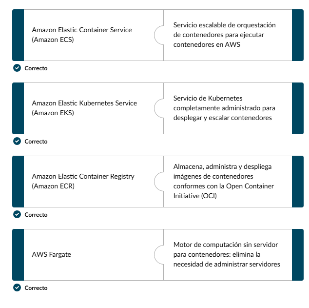

# Introducción a la computación sin servidor
- Cuales son las diferencias entre los servicios de computación sin administrar, administrados y sin servidor en AWS
- Cuáles son las responsabilidades de la empresa y de AWS en relación con la computación sin servidorç
- Servicios como: Elastic Container Service (ECS), Amazon Elastik Kubernetes Service (Amazon EKS) y AWS Elastix Beanstalk; que hacen que la administración de contenerdores y despliegue de aplicaciones sean faciles de administrar 

#### Servicios no administrados y sin administrar
Sin servidor/serverless: No se puede ver ni acceder a la infraestructura subyacente

AWS ofrece servicios administrados y sin administrar para adaptarse a diferentes niveles de control y responsabilidad. Esto te ayuda a proteger y administrar los recursos en la nube de manera eficiente

Con servicios de computación sin administrar como EC2, AWS se encarga de la infraestructuradísica subyacente pero tú eres responsable de configurar, proteger y mantener el sistema operativo, las configuraciones de red y las aplicaciones de tus instancias. Los servicios  administrados, reducen la cantidad de infraestructura que tienes que administrar. 

#### Servicios totalmente administrados
Los servicios totalmente administrados, como los serverless, eliminan la necesidad de aprovisionar o administrar ningún servidor. AWS administra completamente la infraestructura, por lo que puedes centrarte en exclusiva en escribir y desplegar código. Lambda es un servicio de computación serverless en el que AWS se encarga de la infraestructura, escalado, y disponibilidad, mientras tú eres responsable de proteger y administrar el código de la aplicación. 

Diferencias: 

### AWS Lambda
- Qué es Lambda y su funcionalidad como servicio de computación sin servidor.
- Cuáles son los componentes clave de Lambda, como los desencadenadores, funciones y escalado.

Con lambda puedes ejecutar código, no necesitas pensar en administrar un servidor. Cuando usas una función Lambda pones tu código y configuras un disparador y se ejecuta tu código en función de este disparador.
Un ejemplo: un usuario manda una imagen de un cangrejo y el disparador se activa al subir este archivo, o para clasificar esta imagen por su resolución.

Disparadores: procesan datos en tiempo real o clasificar como ejemplo imagenes por su resolución
Además los disparadores se pueden escalar para satisfacer la demanda.
Solo te centras en tu código, es bueno para procesos rápidos basados en eventos, manejar datos de sitios web, procesar lotes de datos y generar informes de datos.
Lambda admite varios lenguajes de programación. 

Lambda es un servicio de computación sin servidor que ejecuta código en respuesta a eventos sin necesidad de aprovisionar o administrar servidores. Administra automáticamente la infraestructura subyacente escalando recursos en función del volumen de solicitudes. Lambda gestiona la ejecución, escalado y asignación de recursos. Puedes optimizar el rendimiento configurando la cantidad de memoria adecuada para cada función.

#### Funcionamiento de Lambda
1. Carga el código de Lambda, que se carga como una función de Lambda
2. Configura el código para que los eventos lo desencadenen, como los servicios de AWS, las aplicaciones móviles o las solicitudes HTTP
3. El código solo se ejecuta cuando se produce un evento, como la carga de un archivo o  una accion del usuario. Lambda se encarga de la administración, escalado y la infraestructura de los servidores. Lambda ejecuta el código solo en función con los datos de eventos que han pasado. De esta forma, el código se ejecuta de manera fiable, segura y eficiente, sin adminitrar servidores o el entorno en el que se ejecuta.
4. Paga solo por el uso de computación utilizado: el precio depende de la cantidad de memoria que asignes a tu función.

Ejemplos Reales:
1. Procesamiento de imágenes en tiempo real para una aplicación de redes sociales
una empresa usa Lambda para procesar las imágenes que suben los usuarios. Cuando se carga una foto se activa Lambda para cambiar el tamaño de la imagen, aplicar filtros y guardarla en un formato optimizado para su almacenamiento. Esto ayuda que la aplicación gestione grandes volumenes de cargas sin necesidad de administrar la infraestrura.

2. Entrega de contenido personalizada para un agregador de noticias
Un agregador de noticias utiliza Lambda para buscar y procesar artículos de noticias, a continuación, adapta las recomendaciones según las preferencias del usuario. Cuando el usuario abre la aplicacion o realiza una búsqueda se activan las funciones Lambda para recuperar datos, ejecutar lógica de personalización y devolver contenido

3. Gestión de eventos en tiempo real para un juego en línea
Una empresa de videojuegos usa Lambda para gestionar los eventos del juego, como las acciones de quienes juegan, los cambios de estado del juego y las actualizaciones de la tabla de clasificación en tiempo real. Cada evento (como conseguir un punto o desbloquear un logro) desencadena una función Lambda que actualiza los datos de la persona que juega y el estado del juego.

#### Demostración de Lambda

Esta es una demostración de cómo conectar Amazon SQS (cola de mensajes) con Lambda para crear un flujo de trabajo basado en eventos. Se definirá ña cola, configurará la función Lmabda, asignará premisos correctos y comprobará que todo funciona desde el mensaje hasta el registro.
En el video nos explica como utilizar SQS para tener una cola de mensajes y enviar mensajes a Lambda. Se creará una función Lamda para que se 

1. Crear Cola SQS
- Entrar en consola SQS
- "Create queue"
- Type: standar, "nombrecola", todo lo demás por defecto
- Creamos la cola sqs

2. Función Lambda
- "Create function"
- Podemos elegir entre crear una desde cero, usar un esquema (una que este hecha) o utilizar una imagen de contenedor
- Nombreamos la función
- Elegimos la versión ejecutable (lenguaje de programación) que usaremos
- Arquitectura x86_64
- Permisos (importante), como la prueba es en laboratorio usaremos el LabRole que son las políticas ya definidas y que nos permite usar estas funciones y servicios. Esto nos permite que Lambda pueda leer los mensajes de SQS
    - Dar permisos a Lambda para leer de SQS (manera manual de agregar permisos)
    1. En la página de tu función Lambda, ve a la pestaña "Configuration" → "Permissions".
    2. Haz clic en el nombre del rol (algo como ProcesaMensaje-role-xxxxx). Te abrirá IAM.
    3. En IAM, haz clic en "Add permissions" → "Attach policies".
    4. Busca AWSLambdaSQSQueueExecutionRole y selecciónala.
    5. Haz clic en "Add permissions".
        

3. Conectar SQS como trigger de Lambda
    1. Vuelve a tu función Lambda en la consola.
    2. En la pestaña "Configuration" → "Triggers", haz clic en "Add trigger".
    3. En el desplegable, selecciona SQS.
    4. En "SQS queue", pega el ARN de tu cola MiColaDePrueba que apuntaste antes.
    5. Batch size: 1 (procesará un mensaje cada vez, más fácil de ver los logs).
    6. Haz clic en "Add".

4. Probar el sistema completo
    1. Ve a SQS → tu cola "nombredetucola".
    2. Haz clic en "Send and receive messages".
    3. En el campo "Message body" escribe: Hola desde SQS, esto es una prueba
    4. Haz clic en "Send message".

    Para ver que Lambda lo procesó:

    1. Ve a Lambda → ProcesaMensaje → pestaña "Monitor".
    2. Haz clic en "View CloudWatch logs".
    3. Abre el log stream más reciente y verás la línea: Mensaje recibido desde SQS: Hola desde SQS, esto es una prueba

Esta es la función Lambda con el desencadenador SQS

Los eventos de registro:

### Contenedores y Orquestación en AWS
- Cómo los contenedores crean un entrono en tiempo de ejecucion uniforme y transferible a diferentes sistemas
- Cómo se usa Amazon Elastic Container Registry para almacenar, administrar y hacer versiones de imágenes de contenedores
- Cómo Amazon ECS y Amazon EKS organizan los contenedores para desplegar, escalar y administrar las aplicaciones
- Cómo AWS Fargate ejecuta contenedores sin necesidad de aprovisionar o administrar servidores

Contenedores: crea un entorno seguro para tener ejecutar tu aplicacion. Empaquetan código. configuración, entorno de ejecución y dependencias en una única unidad portátil.
Cómo se alojan en AWS: los servicios de orquestación de contenedores, escalan automáticamente los contenedores cuando el tráfico aumenta y reducen cuando las cosas se calman. También manejan la recuperación de fallos y supervisión y actualizaciones

Amazon Elastic Container Service (ECS): 
- Simplificado e integrado
- Definir parámetros
- Servicio totalente administrado

Amazon Elastic Kubernetes Service (EKS):
- Plataforma de código abierto que automatiza la implementación, escalado y gestión de aplicaciones
- Más complejo
- Ofrece más control y flexibilidad para implementaciones a gran escala o híbridas

Amazon Elastic Container Registry (ECR):
- Registro Docker totalmente administrado
- Almacena imágenes de contenedores

Cónde se ejecutan los contenedores?
- Amazon EC2
- AWS Fargate (serverless)

Ejeplo para integrarlo todo:
- Comienza subiendo una imagen de contenedor a ECR: es donde las imagenes de contenedor se almacenarán de forma segura
- Elige un servicio de orquestación según tus necesidades: ECS o EKS
- Selecciona en qué plataforma de computación ejecutar tu contenedor: EC2 o Fargate

#### Contenedores y máquinas virtuales (VM)
Un contenedor empaqueta la aplicación con todo lo que necesita para su ejecución por lo que funciona de igual manera en cualquier equipo. Esto ayuda a mover, actualizar y administrar. Los contenedores son más rápidos y ligeros que las máquinas virtuales porque compraten el sistema operativo del equipo que es el host.

#### Coherencia en el despliegue con contenedores
Cuando un entorno de un desarrollador difiere del de prueba o de produccion, los despliegues pueden dar errores y si depuración es complicada. Los contenedores resuelven este problema al mantener el entorno de la aplicación uniforme,  lo que facilita los despliegues y ayuda a solucionar problemas.

#### Escalado de contenedores con orquestación
A medida que las aplicaciones en contenedores escalan, su administración se vuelve más compleja. Una configuración de unos pococs contenedores puede convertirse en cientos o miles de ellos en varios host. A esa escala la gestión manual del ciclo de vida de los contenedores, supervisión y las operaciones generales se pueden volver insostenibles. Aquí es donde entra las herramientas de orquestación. Automatizan el despliegue, escalado y la administración para que todo funcione.

### Servicios de contenedores de AWS
#### Amazon ECS (Amazon Elastic Container Service)
Es un servicio escalable de orquestación de contenedores para ejecutar y administrar contenedores en AWS, como los contenedores Docker.
##### Tipos de inicio de Amazon ECS
- Amazon ECS con Amazon EC2: ideal para pequeñas y medianas empresas que precisan de un control total de la infraestructura. Es adecuada para aplicaciones personalizadas que refieren configuraciones de red o harware específicas con la flexibilidad de Amazon EC2 y la simplicidad de Amazon ECS
- Amazon ECS con AWS Fargate: ideal para empresas emergente o equipos pequeños que crean aplicaciones web con tráfico variable. Es una opción serverless, por lo que los equipos pueden centrarse en el desarrollo mientras ECS se ocupa del escalado y la orquestación.

#### Amazon EKS (Amazon Elastic Kubernetes Service)
servicio completamente administrado para ejecutar Kubernetes en AWS. Simplifica el despliegue, la administración y el escalado de aplicaciones en contenedores mediante Kubernetes de código abierto, con soporte y actualizaciones
##### Tipos de inicio de Amazon EKS
- Amazon EKS con Amazon EC2: ideal para empresas que necesitan un control total de la infraestructura. Ofrece una personalización de las instancias EC2 con la escalabilidad de Kubernetes, lo que resulta ideal para cargas de trabajo complejas a gran escala
- Amazon EKS con AWS Fargate: ideal para equipos que desean flexibilidad de Kubernetes sin tener que administrar servidores. Combina la potencia de Kubernetes con la simplicidad de trabajar sin servidores, lo que ayuda a escalar las aplicaciones rápidamente en varios casos prácticos

#### Amazon ECR (Amazon Elastic Container Registry)
Es el lugar donde puedes almacenar, administrar y desplegar imágenes de contenedores. Admite imágenes de contenedores que siguen los estándares de la Open Container Initiative (OCI). Puedes incorporar, extraer y administrar imágenes en los repositorios de Amazon ECR mediante herramientas de contenedores e interfaces de línea de comandos (CLI) estándar.

#### Fargate
Es un motor de computación sin servidor para contenedores. Funciona tanto con Amazon ECS como con Amazon EKS. Fargate es una plataforma de alojamiento de contenedores, a diferencia de Amazon ECS y Amazon EKS, que son servicios de orquestación de contenedores.

### Servicios de computación adicionales
- Cómo Elastic Beanstalk optimiza el aprovisionamiento y la administración del entorno.
- Cómo AWS Batch administra las tareas de computación a gran escala y ajusta automáticamente los recursos en función de la demanda.
- Cómo Amazon Lightsail optimiza la configuración y la administración de las aplicaciones web sin necesidad de una infraestructura compleja.
- Cómo AWS Outposts extiende los servicios de AWS a los entornos locales y admite arquitecturas de nube híbrida.

#### Elastic Beanstalk
Es un servicio completamente administrado que optimiza el despliegue, la administración y el escalado de las aplicaciones web. Los desarrolladores pueden cargar su código y Elastic Beanstalk gestiona automáticamente el aprovisionamiento de la infraestructura, el escalado, el equilibrio de carga y la supervisión del estado de las aplicaciones. Es compatible con varios lenguajes y marcos de programación, como Java, .NET, Python, Node.js, Docker y más.
Ideal para: desplegar y administrar aplicaciones web, API RESTful, servicios de backend móviles y arquitecturas de microservicios, con escalado automatizado y administración simplificada de la infraestructura.

#### AWS Batch
Es un servicio completamente administrado que puedes utilizar para ejecutar cargas de trabajo de computación por lotes en AWS. Programa, administra y escala automáticamente los recursos de computación para los trabajos por lotes, lo que optimiza la asignación de recursos en función de los requisitos del trabajo.
Ideal para:  procesar cargas de trabajo paralelas a gran escala en áreas como la computación científica, el análisis de riesgos financieros, la transcodificación de archivos multimedia, el procesamiento de big data, el entrenamiento de machine learning y la investigación genómica.

#### Lightsail
Es un servicio en la nube que ofrece servidores privados virtuales (VPS), almacenamiento, bases de datos y redes a un precio mensual predecible. Es ideal para pequeñas empresas, cargas de trabajo básicas y desarrolladores que buscan una experiencia de AWS sencilla sin la complejidad que supone la consola de administración de AWS completa.
Ideal para: aplicaciones web básicas, sitios web con poco tráfico, entornos de desarrollo y pruebas, sitios web de pequeñas empresas, blogs y servicios de aprendizaje en la nube.

#### Outpost
Es una solución de nube híbrida completamente administrada que extiende la infraestructura y los servicios de AWS a los centros de datos locales. Proporciona una experiencia uniforme entre las instalaciones y la nube de AWS, y ofrece componentes de computación, almacenamiento y redes.
Ideal para: aplicaciones de baja latencia, procesamiento de datos en ubicaciones remotas, migración y modernización de aplicaciones heredadas y cumplimiento de los requisitos de residencia de datos o conformidad normativa.